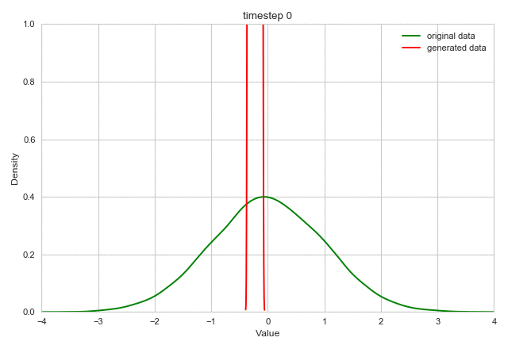

# Simple PyTorch GAN

This project implements a simple generate adversarial network (GAN) to approximate a one-dimensional normal distribution. 

## Result
The following animation shows how the GAN learns to approximate the original data distribution within 1000 iterations.

